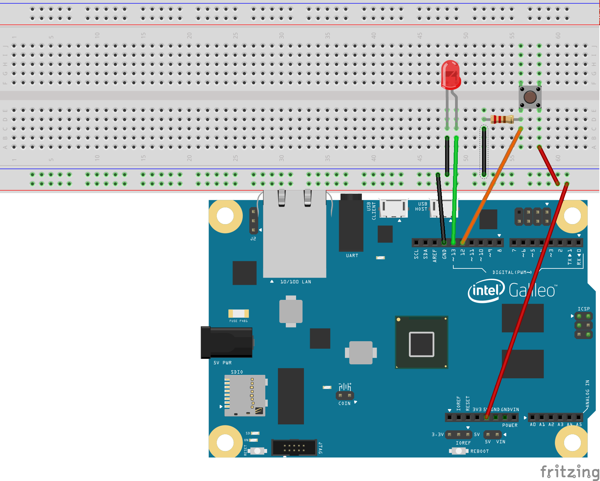
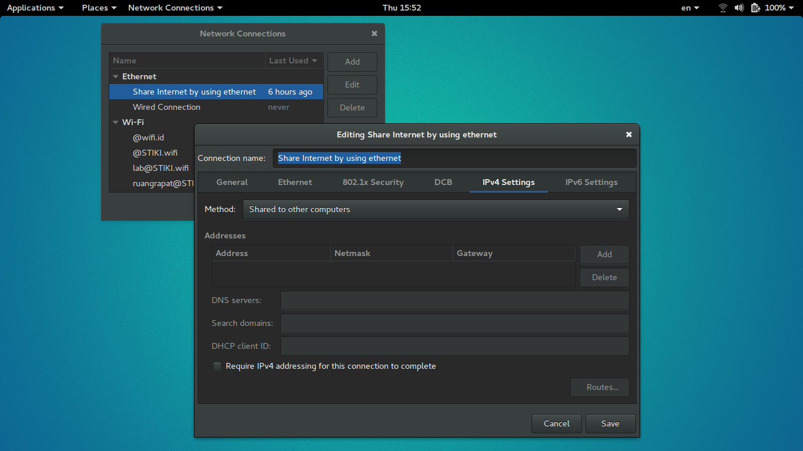

# What we will do
* [The Program](https://github.com/goFrendiAsgard/galileo-test-case)
* [Demo](https://www.youtube.com/watch?v=0R7KLZMWjZA)

# The Hardware

* Laptop
* Intel Galileo
* Power chord
* RJ 45 (Cross)
* USB cable (You can use your smartphone's charger)
* Bread board
* Push button
* LED
* Wires

# Prepare SD Card
* Download image file [here](http://downloadmirror.intel.com/25384/eng/iot-devkit-201510010757-mmcblkp0-galileo.direct.xz)
* Extract the image file
* Install image file to your SD Card
    - Format SD Card in FAT32
    - Windows user use Win32DiskImage
    - Linux user use `dd -if [image file name] -of [device]`

# Share Internet Connection
* Ubuntu user: create new wire network connection profile

* Windows user: find something similar

# Prepare the hardware
* Put SD Card into Galileo's slot
* Put power chord, wait until SD Lamp turn on
* Put micro USB to Galileo, connect it to your computer

# Upload Arduino Sketch
* Upload the sketch by using arduino IDE

```c
void setup() {
  system("ifconfig eth0 10.42.0.20 netmask 255.255.255.0"); // Set the IP Address of galileo
  system("route add default gw 10.42.0.1 eth0"); // Set your computer as gateway (assuming it's IP is 10.42.0.1)
  system("telnetd -l /bin/sh");
}

void loop() {
  system("ifconfig > /dev/ttyGS0"); // Send IP information to USB serial (/dev/ttyGS0 is USB serial)
  delay(5000); // Wait for 5 seconds before send it again
}
```

# Prepare Galileo
* Connect galileo to your computer by using RJ45 (Cross)
* Connect your computer to the internet
* Connect by using ssh (or putty) `ssh root@10.42.0.20`
* `vi /etc/resolv.conf`, add this `nameserver 8.8.8.8`

# Prepare development environment
* create directory, and go to that directory `mkdir /home/root/test && cd /home/root/test`
* install mraa library `opkg install mraa`
* update npm `npm install -g npm`
* install
    - install `mraa` by using this command: `npm install mraa`
    - install `express` by using this command: `npm install express`
    - install `socket.io` by using this command: `npm install socket.io`
* init directory `npm init`

# Coding
* directory structure

```
test
├── app.js  <-- Our main program, create it
├── node_modules <-- generated by npm
├── public <-- Static files, create it
|   |
│   ├── jquery-3.1.1.min.js <-- Jquery, because we will use some AJAX, and jquery make it easy
│   └── socket.io.min.js <-- Socket.io, for client socket
└──views                                                                                                                 │
    └── view.html  <-- The view
```
* test/app.js

```javascript
// Create app, http, and socket
var express = require('express');
var mraa = require('mraa');
var app = express();
var http = require('http').Server(app);
var io = require('socket.io')(http);


// let everything from public directory served as static files
app.use('/static', express.static('public'));

// Define led object as output (pin 13)
var led = new mraa.Gpio(13);
led.dir(mraa.DIR_OUT);

// Define trig and echo as output (echo: pin 12, trig : print 11)
var btn = new mraa.Gpio(12);
btn.dir(mraa.DIR_IN);

// Routes
app.get('/', function(req, res){
    res.sendFile(__dirname+'/views/view.html');
});

app.get('/turn-on', function(req, res){
    led.write(1);
    res.send('turned on');
});

app.get('/turn-off', function(req, res){
    led.write(0);
    res.send('turned off');
});

// Socket
io.on('connection', function(socket){
    console.log('Socket connection openned');
    // socket event
    socket.on('disconnect', function(){
       console.log('Socket connection closed');
    });
});

// function to detect btn state and send it to every clients
function detect_button(){
    state = btn.read();
    io.emit('button state', state);
    setTimeout(detect_button,100); // let's do it again after 1/10 second
}
detect_button(); // execute the function

// Listen
http.listen(8080, function(){
    console.log('Listening request from port 8080, press Ctrl+C to end it');
});
```
* test/views/view.html

```html
<body>
    <a class="ajax-link" href="turn-on">Turn On</a> | <a class="ajax-link" href="turn-off">Turn Off</a>
    <div id="state">
    </div>
    <script src="static/socket.io.min.js"></script>
    <script src="static/jquery-3.1.1.min.js"></script>
    <script>
        // send ajax request to server
        $('.ajax-link').click(function(event){
            event.preventDefault();
            url = $(this).attr('href');
            $.ajax({'url':url});
        });
        // catch "button state" message from client
        socket = io();
        socket.on("button state", function(msg){
            if(msg == 1){
                $('#state').html('Pressed');
            }else{
                $('#state').html('');
            }
        });
    </script>
</body>
```
